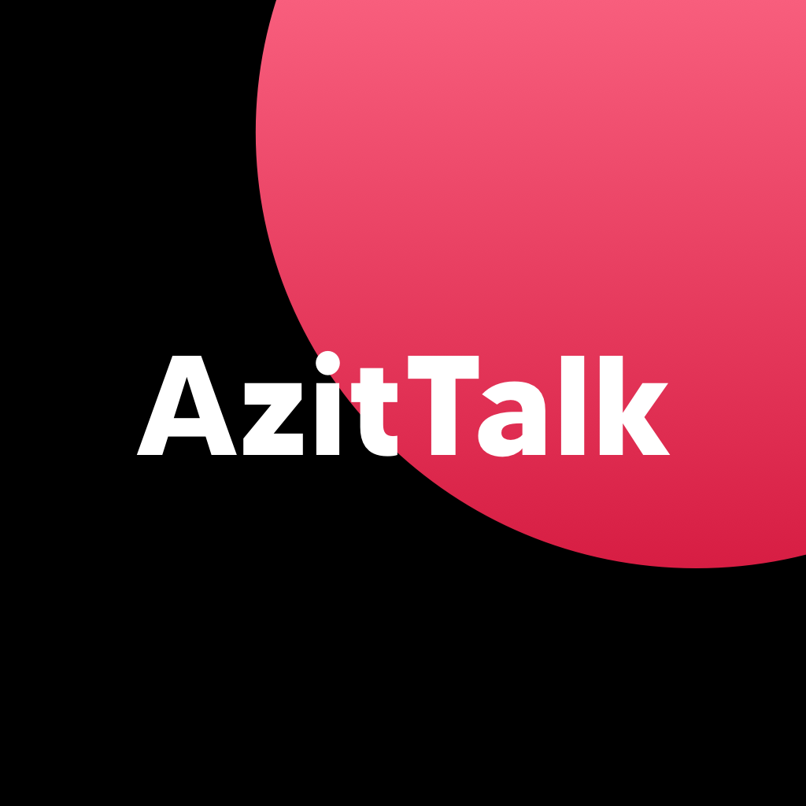
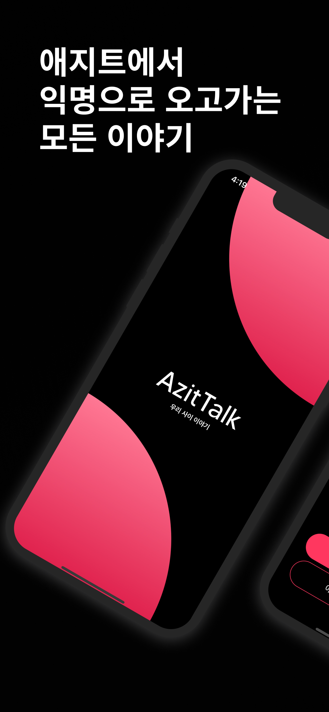
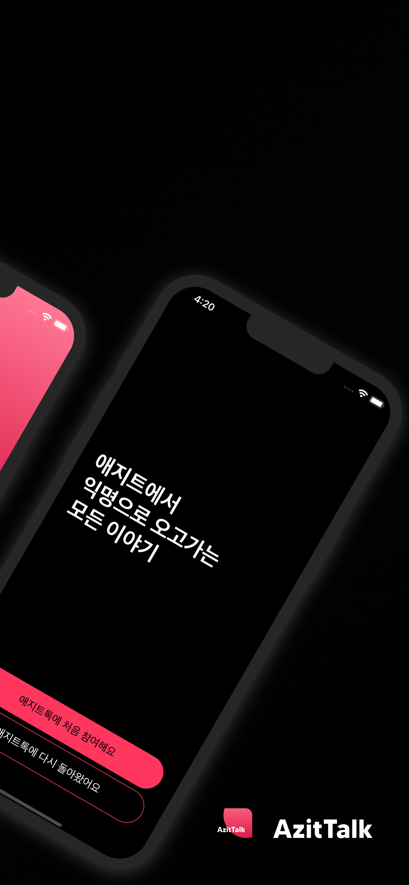
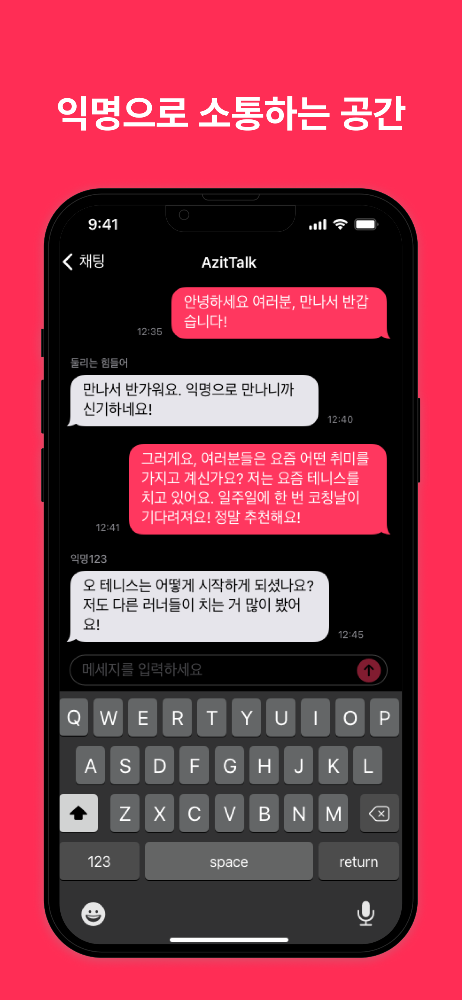
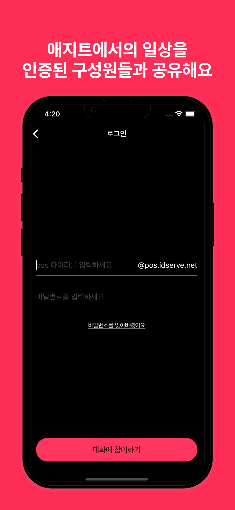
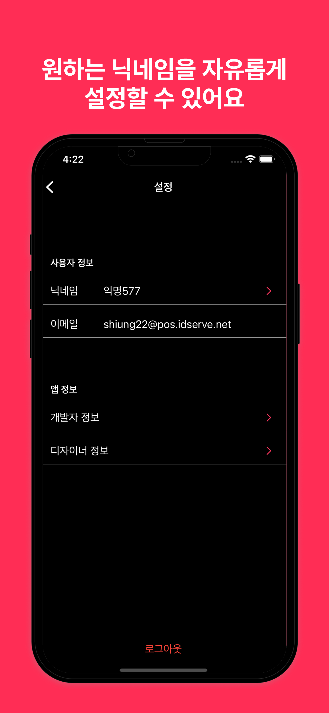

# AzitTalk

📆 v1.0.0 : 2022. 04. 25. ~ 2022. 06. 11.

📆 v2.0.0 : 2022. 10. 02. ~ 2022. 10. 16.

 

[🍎 App Store 🔗](https://apps.apple.com/kr/app/azittalk/id1624679655)
[✈️ Test Flight 🔗](https://testflight.apple.com/join/XeAAUBNf)

## 📱 Screenshots

||||||
|:-:|:-:|:-:|:-:|:-:|

 

## 🧑🏻‍💻👩🏻‍💻 Members

|Developer|Designer|
|:-:|:-:|
|||

 

## 🎯 Project Goal

- Apple Developer Academy @ POSTECH 구성원들을 위해 개발된 익명 채팅앱입니다.

 

## 🛠 Developement Environment

|Environment|Version|
|:-:|:-:|
|Swift|5.6.1|
|Xcode|13.4.1|
|iOS Deployment Target|15.0|

 

## Tech Stacks

- SwiftUI, MessageUI
- CocoaPods
- FirebaseAuth, FirebaseMessaging, FirebaseFirestore, FirebaseFunctions

 

## 기능

- Firebase를 이용한 이메일 인증 로그인
- 실시간 채팅 및 Push 알림
- 채팅 Data Caching
- 사용자가 마지막으로 읽은 부분 기록
- Dynamic Type 적용
- 욕설 필터링
- 사용자 차단 및 신고하기

 
